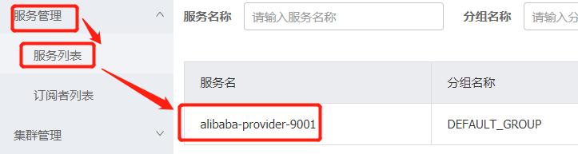

# 创建统一依赖中心

* 环境使用Maven 聚合工程, 方便管理

1. 新建Maven工程 , pom.xml

```xml
<?xml version="1.0" encoding="UTF-8"?>

<project xmlns="http://maven.apache.org/POM/4.0.0" xmlns:xsi="http://www.w3.org/2001/XMLSchema-instance"
         xsi:schemaLocation="http://maven.apache.org/POM/4.0.0 http://maven.apache.org/xsd/maven-4.0.0.xsd">
    <modelVersion>4.0.0</modelVersion>

    <groupId>com.qiangzi.springcloud</groupId>
    <artifactId>alibaba2020</artifactId>
    <version>1.0-SNAPSHOT</version>
    <packaging>pom</packaging>

    <modules>
        <module>.....</module>
    </modules>

    <!-- 统一管理jar包版本 -->
    <properties>
        <project.build.sourceEncoding>UTF-8</project.build.sourceEncoding>
        <maven.compiler.source>1.8</maven.compiler.source>
        <maven.compiler.target>1.8</maven.compiler.target>
        <junit.version>4.12</junit.version>
        <log4j.version>1.2.17</log4j.version>
        <lombok.version>1.18.12</lombok.version>
        <druid.version>1.1.21</druid.version>
        <mybatis.spring.boot.version>1.3.0</mybatis.spring.boot.version>
        <mybatis-plus.version>3.2.0</mybatis-plus.version>
        <jackson-version>2.10.3</jackson-version>
    </properties>

    <!-- 子模块继承之后，提供作用：锁定版本+子modlue不用写groupId和version  -->
    <dependencyManagement>
        <dependencies>


            <!-- =======My start        ========== -->
            <dependency>
                <groupId>com.fasterxml.jackson.core</groupId>
                <artifactId>jackson-core</artifactId>
                <version>${jackson-version}</version>
            </dependency>
            <dependency>
                <groupId>com.fasterxml.jackson.core</groupId>
                <artifactId>jackson-databind</artifactId>
                <version>${jackson-version}</version>
            </dependency>
            <dependency>
                <groupId>com.baomidou</groupId>
                <artifactId>mybatis-plus-boot-starter</artifactId>
                <version>${mybatis-plus.version}</version>
            </dependency>

            <!-- =======My end          ========== -->


            <!--spring boot 2.2.2-->
            <dependency>
                <groupId>org.springframework.boot</groupId>
                <artifactId>spring-boot-dependencies</artifactId>
                <version>2.2.2.RELEASE</version>
                <type>pom</type>
                <scope>import</scope>
            </dependency>
            <!--spring cloud Hoxton.SR1-->
            <dependency>
                <groupId>org.springframework.cloud</groupId>
                <artifactId>spring-cloud-dependencies</artifactId>
                <version>Hoxton.SR1</version>
                <type>pom</type>
                <scope>import</scope>
            </dependency>
            <!--spring cloud alibaba 2.1.0.RELEASE-->
            <dependency>
                <groupId>com.alibaba.cloud</groupId>
                <artifactId>spring-cloud-alibaba-dependencies</artifactId>
                <version>2.1.0.RELEASE</version>
                <type>pom</type>
                <scope>import</scope>
            </dependency>


            <dependency>
                <groupId>mysql</groupId>
                <artifactId>mysql-connector-java</artifactId>
                <version>8.0.19</version>
            </dependency>

            <dependency>
                <groupId>com.alibaba</groupId>
                <artifactId>druid-spring-boot-starter</artifactId>
                <version>${druid.version}</version>
            </dependency>

            <dependency>
                <groupId>org.mybatis.spring.boot</groupId>
                <artifactId>mybatis-spring-boot-starter</artifactId>
                <version>${mybatis.spring.boot.version}</version>
            </dependency>
            <dependency>
                <groupId>junit</groupId>
                <artifactId>junit</artifactId>
                <version>${junit.version}</version>
            </dependency>
            <dependency>
                <groupId>log4j</groupId>
                <artifactId>log4j</artifactId>
                <version>${log4j.version}</version>
            </dependency>
            <dependency>
                <groupId>org.projectlombok</groupId>
                <artifactId>lombok</artifactId>
                <version>${lombok.version}</version>
                <optional>true</optional>
            </dependency>
        </dependencies>
    </dependencyManagement>

    <build>
        <plugins>
            <plugin>
                <groupId>org.springframework.boot</groupId>
                <artifactId>spring-boot-maven-plugin</artifactId>
                <configuration>
                    <fork>true</fork>
                    <addResources>true</addResources>
                </configuration>
            </plugin>
        </plugins>
    </build>

</project>
```

## 子项目 alibaba-naocs-provider

```xml
<?xml version="1.0" encoding="UTF-8"?>
<project xmlns="http://maven.apache.org/POM/4.0.0"
  xmlns:xsi="http://www.w3.org/2001/XMLSchema-instance"
  xsi:schemaLocation="http://maven.apache.org/POM/4.0.0 http://maven.apache.org/xsd/maven-4.0.0.xsd">
  <parent>
    <artifactId>alibaba2020</artifactId>
    <groupId>com.qiangzi.springcloud</groupId>
    <version>1.0-SNAPSHOT</version>
  </parent>
  <modelVersion>4.0.0</modelVersion>

  <artifactId>alibaba-nacos-provider</artifactId>

  <dependencies>
    <!--SpringCloud ailibaba nacos -->
    <dependency>
      <groupId>com.alibaba.cloud</groupId>
      <artifactId>spring-cloud-starter-alibaba-nacos-discovery</artifactId>
    </dependency>
    <!-- SpringBoot整合Web组件 -->
    <dependency>
      <groupId>org.springframework.boot</groupId>
      <artifactId>spring-boot-starter-web</artifactId>
    </dependency>
    <dependency>
      <groupId>org.springframework.boot</groupId>
      <artifactId>spring-boot-starter-actuator</artifactId>
    </dependency>
    <!--日常通用jar包配置-->
    <dependency>
      <groupId>org.springframework.boot</groupId>
      <artifactId>spring-boot-devtools</artifactId>
      <scope>runtime</scope>
      <optional>true</optional>
    </dependency>
    <dependency>
      <groupId>org.projectlombok</groupId>
      <artifactId>lombok</artifactId>
      <optional>true</optional>
    </dependency>
    <dependency>
      <groupId>org.springframework.boot</groupId>
      <artifactId>spring-boot-starter-test</artifactId>
      <scope>test</scope>
    </dependency>
  </dependencies>

</project>
```

application.yml

```yml
server:
  port: 9001
spring:
  application:
    name: alibaba-provider
  cloud:
    nacos:
      discovery:
        server-addr: localhost:8848 #配置Nacos地址

management:
  endpoints:
    web:
      exposure:
        include: '*'
```

启动类 在Spring Cloud F 后 **@EnableDiscoveryClient** 取代其他发现

```java
package com.osvue.spring.cloud.alibaba;

import org.springframework.boot.SpringApplication;
import org.springframework.boot.autoconfigure.SpringBootApplication;
import org.springframework.cloud.client.discovery.EnableDiscoveryClient;

/**
 * @Author: Mr.Han
 * @Description: alibaba2020
 * @Date: Created in 2020/4/19_9:44
 * @Modified By: THE GIFTED
 */
@EnableDiscoveryClient
@SpringBootApplication
public class ProviderApp9001 {

  public static void main(String[] args) {
    SpringApplication.run(ProviderApp9001.class,args);
  }
}
```

测试类,controller省略..............

启动访问Nacos 如下图



* 至此提供者搭建成功

## 负载均衡测试

* 相同的环境, 搭建同一套系统 ,根据端口的映射,来进行区分
* 其核心就是spring.application.name: alibaba-provider,通过相同的服务名称, 来进行负载均衡策略

```java

  @Value("{server.port}")
  String prot;

  @GetMapping("/osvue")
  public String say(){
    return "hello osvue"+prot;
  }
```

application.yml

```yml
server:
  port: 9002

spring:
  application:
    name: alibaba-provider
  cloud:
    nacos:
      discovery:
        server-addr: localhost:8848 #配置Nacos地址
management:
  endpoints:
    web:
      exposure:
        include: '*'
```

启动如下图


## 创建基于NACOS服务消费者

## 使用OpenFeign 做负载均衡

```xml
<?xml version="1.0" encoding="UTF-8"?>
<project xmlns="http://maven.apache.org/POM/4.0.0"
  xmlns:xsi="http://www.w3.org/2001/XMLSchema-instance"
  xsi:schemaLocation="http://maven.apache.org/POM/4.0.0 http://maven.apache.org/xsd/maven-4.0.0.xsd">
  <parent>
    <artifactId>alibaba2020</artifactId>
    <groupId>com.qiangzi.springcloud</groupId>
    <version>1.0-SNAPSHOT</version>
  </parent>
  <modelVersion>4.0.0</modelVersion>

  <artifactId>alibaba-consumer86</artifactId>
  <dependencies>
    <!--SpringCloud ailibaba nacos -->
    <dependency>
      <groupId>com.alibaba.cloud</groupId>
      <artifactId>spring-cloud-starter-alibaba-nacos-discovery</artifactId>
    </dependency>
    <!-- 引入自己定义的api通用包，可以使用Payment支付Entity -->
    <dependency>
      <groupId>com.qiangzi.springcloud</groupId>
      <artifactId>commons</artifactId>
      <version>${project.version}</version>
    </dependency>
    <dependency>
      <groupId>org.springframework.cloud</groupId>
      <artifactId>spring-cloud-starter-openfeign</artifactId>
    </dependency>
    <!-- SpringBoot整合Web组件 -->
    <dependency>
      <groupId>org.springframework.boot</groupId>
      <artifactId>spring-boot-starter-web</artifactId>
    </dependency>
    <dependency>
      <groupId>org.springframework.boot</groupId>
      <artifactId>spring-boot-starter-actuator</artifactId>
    </dependency>
    <!--日常通用jar包配置-->
    <dependency>
      <groupId>org.springframework.boot</groupId>
      <artifactId>spring-boot-devtools</artifactId>
      <scope>runtime</scope>
      <optional>true</optional>
    </dependency>
    <dependency>
      <groupId>org.projectlombok</groupId>
      <artifactId>lombok</artifactId>
      <optional>true</optional>
    </dependency>
    <dependency>
      <groupId>org.springframework.boot</groupId>
      <artifactId>spring-boot-starter-test</artifactId>
      <scope>test</scope>
    </dependency>
  </dependencies>

</project>
```

application.yml  可以配置超时时间等策略, 本次省略

```yml
server:
  port: 86
spring:
  application:
    name: alibaba-consumer
  cloud:
    nacos:
      discovery:
        server-addr: localhost:8848
```

## 声明FeignClient接口 

- 其中 **@FeignClient(value = "alibaba-provider")**
- **接口定义**<就是把提供者的controller 除了方法体外,粘贴了过来>

```java
package com.osvue.spring.cloud.alibaba.feign.client;
/**
 * @Author: Mr.Han
 * @Description: alibaba2020
 * @Date: Created in 2020/4/19_10:43
 * @Modified By: THE GIFTED
 */
@Component
@FeignClient(value = "alibaba-provider")
public interface ProClient {
  @GetMapping("/osvue")
  public String say();
}
```

启动类

```java
package com.osvue.spring.cloud.alibaba;
/**
 * @Author: Mr.Han
 * @Description: alibaba2020
 * @Date: Created in 2020/4/19_10:29
 * @Modified By: THE GIFTED
 */
@SpringBootApplication
@EnableDiscoveryClient
@EnableFeignClients
public class ConsuApp86 {

  public static void main(String[] args) {
    SpringApplication.run(ConsuApp86.class,args);
  }
}
 
```

* 直接在Controller 注入FeignClient ,访问即可